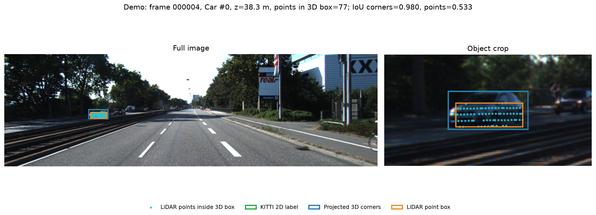
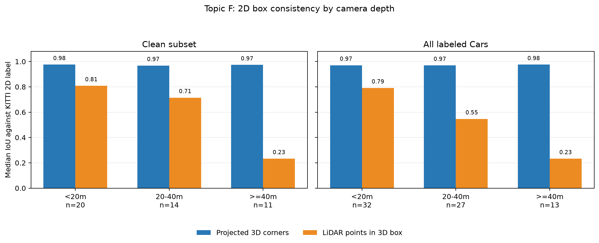
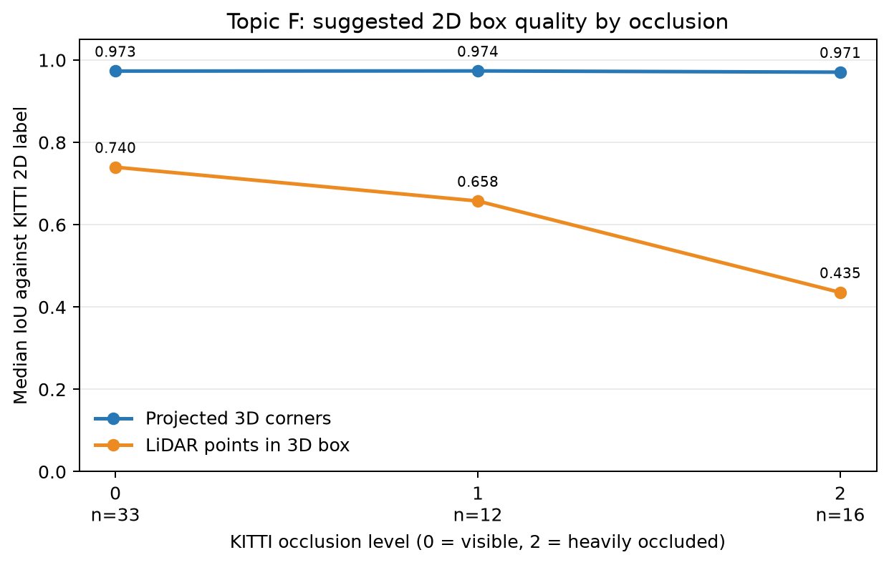
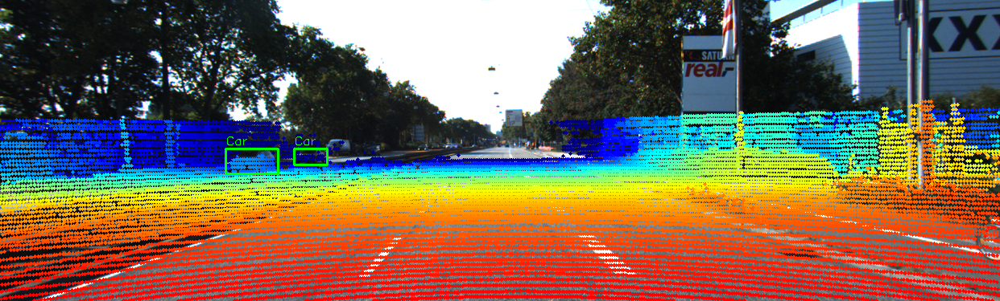
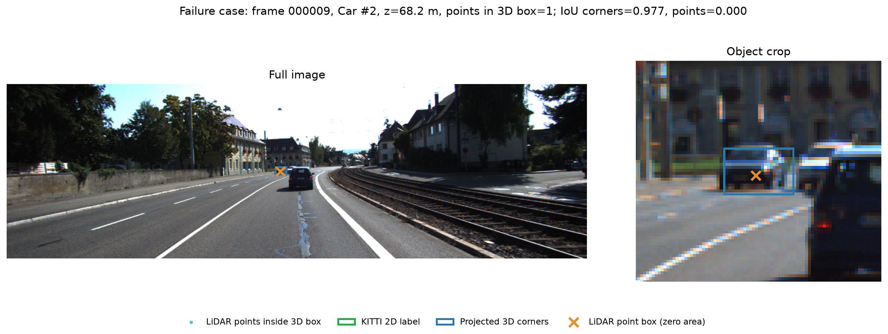

# Báo cáo Day 6: QA nhãn 2D bằng LiDAR

- **Họ tên:** Nguyễn Hoàng Duy
- **MSSV:** 2A202602751
- **Lớp:** K4
- **Link repo:** https://github.com/HoangDiine/NguyenHoangDuy-2A202602751-Track4-Day21
- **Topic:** F — Hỗ trợ gán nhãn bằng LiDAR
- **Dataset:** `data/kitti_mini`
- **Các frame đã dùng:** 000001, 000004, 000007, 000008, 000009, 000010, 000011, 000012, 000015, 000016, 000019, 000021, 000023, 000025, 000031, 000032, 000043, 000048, 000049, 000061

## 1. Claim

Với xe Car có `truncated <= 0.1` và `occluded <= 1` ở khoảng cách camera `z >= 40 m`, median IoU của box tạo từ điểm LiDAR thấp hơn median IoU của box tạo bằng cách chiếu 8 góc 3D.

## 2. Evidence

Mỗi box dự đoán được so với bbox 2D KITTI bằng IoU liên tục; depth là `location[2]` của label. Median điểm là số raw LiDAR return nằm trong oriented 3D box.

| Tập / khoảng cách | n | IoU median, 8 góc | IoU median, điểm LiDAR | Median điểm trong 3D box |
|---|---:|---:|---:|---:|
| Sạch, <20 m | 20 | 0.976 | 0.808 | 759 |
| Sạch, 20–40 m | 14 | 0.968 | 0.715 | 127 |
| Sạch, >=40 m | 11 | 0.973 | 0.233 | 13 |
| Tất cả xe, <20 m | 32 | 0.971 | 0.791 | 890 |
| Tất cả xe, 20–40 m | 27 | 0.969 | 0.547 | 74 |
| Tất cả xe, >=40 m | 13 | 0.975 | 0.233 | 13 |

Claim được ủng hộ trong mẫu này: ở nhóm sạch >=40 m, IoU median là 0.233 so với 0.973. Kết quả mô tả 11 xe xa, không khẳng định ý nghĩa thống kê tổng quát.
Box từ điểm LiDAR có diện tích ở 10/11 xe sạch trong nhóm xa; frame `000009` là ví dụ box suy biến.

CSV theo từng object: `results/topic_f_object_iou.csv`; bảng tổng hợp: `results/topic_f_iou_by_distance.csv`; plot: `results/figures/topic_f_iou_by_distance.png`.

### CP3: kết quả theo mức che khuất

So sánh ba mức `occluded = 0/1/2` trên cùng dataset KITTI mini và class Car, giữ `truncated <= 0.1`. Sáu xe có `occluded = 3` không nằm trong ba mức này nên được loại khỏi bảng.

| Mức che khuất | n xe | IoU median, 8 góc 3D | IoU median, điểm LiDAR |
|---:|---:|---:|---:|
| 0 | 33 | 0.973 | 0.740 |
| 1 | 12 | 0.974 | 0.658 |
| 2 | 16 | 0.971 | 0.435 |

Khi mức che khuất tăng từ 0 lên 2, IoU median của box từ điểm LiDAR giảm từ 0.740 xuống 0.435; box chiếu từ 8 góc gần như ổn định, từ 0.973 xuống 0.971. Đây là xu hướng mô tả trong mẫu hiện có: phân bố khoảng cách giữa các mức che khuất không giống nhau, nên không thể kết luận che khuất là nguyên nhân duy nhất.

Đối chiếu riêng vùng `20–40 m` cho kết quả cùng chiều: IoU box LiDAR lần lượt là 0.789 / 0.508 / 0.485 với `n = 11 / 3 / 13`; IoU box 8 góc là 0.967 / 0.970 / 0.970. Nhóm `occluded = 1` chỉ có 3 xe nên kết quả nhóm này cần được xem thận trọng.

CSV tổng hợp: `results/topic_f_iou_by_occlusion.csv`; biểu đồ: `results/figures/topic_f_iou_by_occlusion.png`.









## 3. Failure case



- **Trường hợp:** KITTI mini, frame `000009`, Car #2 ở độ sâu camera `68.25 m`; nhãn có `truncated=0`, `occluded=0`.
- **Quan sát:** Chỉ có `1` điểm LiDAR trong box 3D. Box 2D lấy từ điểm đó suy biến, IoU với nhãn 2D là `0.000`; box tạo bằng cách chiếu 8 góc 3D có IoU `0.977`. Ảnh có toàn cảnh và crop phóng to, trong đó box từ điểm hiện thành dấu X vì không có diện tích.
- **Khi nào sai:** Cách tạo box bằng min/max điểm LiDAR không đáng tin khi xe ở xa và số điểm phản hồi trong box 3D quá ít.
- **Nguyên nhân:** Ở khoảng cách xa, LiDAR chỉ trả về một điểm trên xe này. Một điểm không thể mô tả chiều rộng và chiều cao của xe, nên phép lấy min/max tạo ra box suy biến.
- **Lớp debug:** **Preprocess / độ phủ cảm biến**. Bằng chứng hiện tại nghiêng về thiếu điểm LiDAR, không cho thấy nhãn 2D sai hay phép chiếu 8 góc sai.
- **Cách phát hiện khi chạy thật:** Ghi `points_in_3d_box`, kiểm tra box có diện tích, và so IoU box gợi ý với nhãn 2D. Cảnh báo để người xem lại nếu có dưới `5` điểm hỗ trợ hoặc box suy biến; trong bước QA có nhãn 2D, cũng cảnh báo khi IoU dưới `0.5`. Ngưỡng `5` là heuristic ban đầu — failure này có `1` điểm — cần hiệu chỉnh trên tập validation lớn hơn; cảnh báo không tự ghi đè nhãn.

## 4. Khuyến nghị nếu triển khai thật

**Use-case:** Dùng trong pipeline kiểm duyệt nhãn cho bộ dữ liệu xe tự hành, sau khi ghép ảnh camera với LiDAR và trước khi người gán nhãn chốt 2D box. Hiển thị nhãn hiện có, box chiếu từ 8 góc 3D, box từ điểm LiDAR và số điểm hỗ trợ để reviewer quyết định.

**Đánh đổi:** Trên máy hiện tại, xử lý 20 frame / 72 xe mất `2.978 s` (khoảng `149 ms/frame`, gồm khởi động Python và lưu ảnh). Vì đây là bước QA, nên chạy theo lô ở nền thay vì chặn luồng perception thời gian thực; đổi lại, cần thêm CPU và thời gian reviewer xem cảnh báo. Thời gian này chỉ đại diện cho máy và tập mini đang dùng.

**Chỉ số log và cảnh báo:** Ghi `points_in_3d_box`, `lidar_points_has_area`, IoU giữa box gợi ý với nhãn 2D, và tỷ lệ object bị gắn cờ theo frame. Đưa object vào hàng chờ review nếu có dưới `5` điểm hỗ trợ, box suy biến hoặc IoU dưới `0.5`; không tự ghi đè nhãn. Hai ngưỡng là heuristic ban đầu và cần hiệu chỉnh trên validation lớn hơn để cân bằng cảnh báo nhầm với lỗi bị bỏ sót.

## 5. Cách chạy lại

```bash
python -m src.topic_f_qa --data-root data/kitti_mini --out-dir results --demo-frame 000004 --demo-car-index 0 --failure-frame 000009 --failure-car-index 2
python -m starter.projection --data-root data/kitti_mini --frame 000004
python tools/check_submission.py
```

Kiểm tra tái lập đã chạy lần hai bằng lệnh sau; cả ba CSV khớp hoàn toàn với lần chạy đầu. Thư mục kiểm tra tạm đã được xóa sau khi so sánh.

```bash
python -m src.topic_f_qa --data-root data/kitti_mini --out-dir results/repro_check --demo-frame 000004 --demo-car-index 0 --failure-frame 000009 --failure-car-index 2
python -c "from pathlib import Path; import filecmp; names=['topic_f_object_iou.csv','topic_f_iou_by_distance.csv','topic_f_iou_by_occlusion.csv']; ok=all(filecmp.cmp(Path('results')/n, Path('results/repro_check')/n, shallow=False) for n in names); print('GIỐNG HỆT' if ok else 'KHÁC NHAU'); assert ok"
```

## 6. Khai báo sử dụng AI

| Công cụ | Dùng cho việc gì | Kiểm chứng kết quả |
|---|---|---|
| OpenAI Codex | Phân tích yêu cầu; hỗ trợ viết phép chiếu và script Topic F; tạo bảng, biểu đồ, ảnh demo/failure và biên tập report | Đã chạy trên 20 frame KITTI (72 xe); kiểm tra số liệu frame `000009`, xem ảnh failure, chạy lại và so sánh ba CSV byte-for-byte. Người nộp cần đọc và giải thích được code cũng như giới hạn của các ngưỡng heuristic. |
